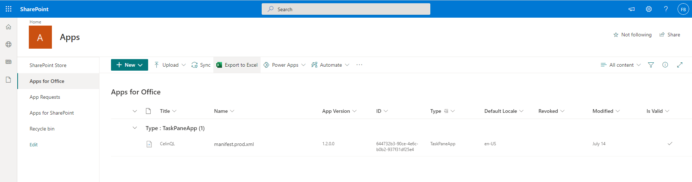
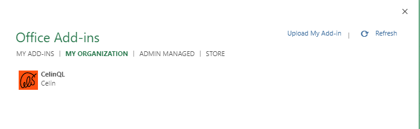
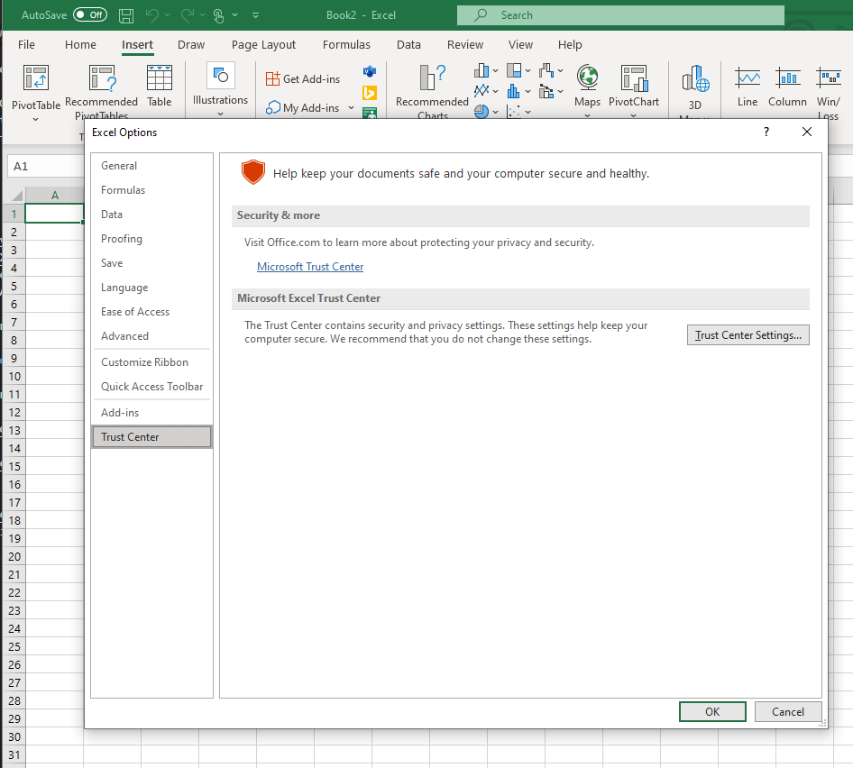
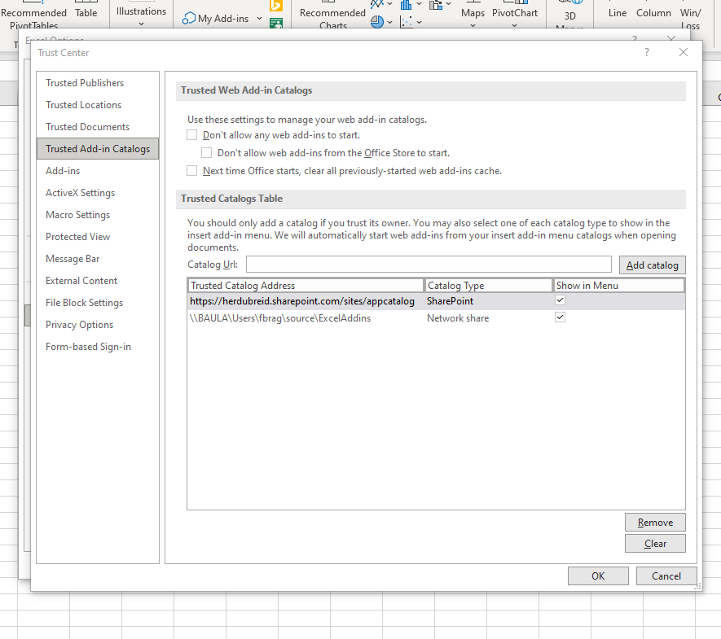
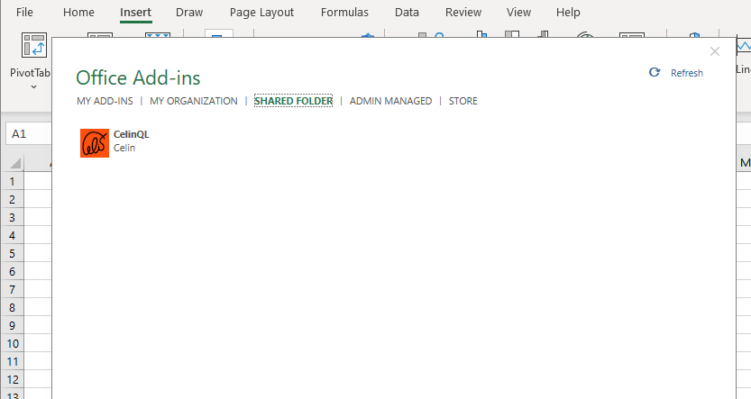
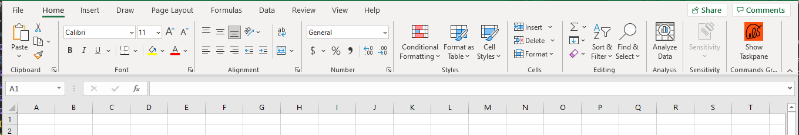

# Celin.Query

## Solution

The solution has two components.

### Celin.Query.Functions

This is the .Net part that runs as an Azure function.

### QueryExcelAddin

This is the Excel React Add-Ins component that runs as a static websited on Azure.

## Installation

There are three options for installing the Add-Ins.

* Side-loading for Excel Online.  The quick-and-dirty way to check it out.
* Upload the manifest to the Apps for Office site of SharePoint.
* Save the manifest on a file share.

### Side-loading Add-Ins

This only works for Excel on-line.

1. Open Excel on-line (try [this ](https://herdubreid.sharepoint.com/:x:/s/celinql/EYBwRJ-spmZFuj2D6S3Sy0YBSXPZv4ozVJglWjG8IrXWWg?e=jjRwFu)for example).
2. Select Insert -> Office Add-ins.
3. Select the 'Upload My Add-in' option and upload the manifest file.

### Upload the manifest to the SharePoint App site

1. Open/create SharePoint App Catalogue:
[Distribute business apps using the App Catalog - SharePoint - SharePoint in Microsoft 365 | Microsoft Docs](https://docs.microsoft.com/en-us/sharepoint/use-app-catalog)
2. Upload the manifest to 'Apps for Office' site:

3. For Excel on-line, the Add-in is available under 'MY ORGANIZATION' and select Insert -> Office Add-ins:

4. To make the Add-in available for desktop Excel, open Trust Center Settings... under File -> Options:

5. Add the URL reference to the SharePoint catalogue as Trusted Add-in Catalogs.

This will make the Add-in available under 'MY ORGANIZATION'.

### Save the manifest on a Network-Folder

Save the manifest to a network-folder and share it.  Add the network path of the shared folder to the Trusted Add-in Catalogs using the step 5 above.

This will make the Add-in available under 'SHARED FOLDER'.

The Add-in is available on the Home menu once added.
