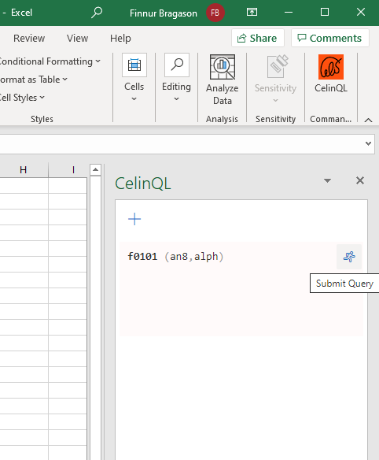
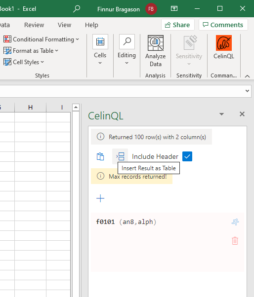

# Overview

An Excel Add-in to query JDE tables and business views.

## Usage Example

- Open the CelinQL Add-in.

The Add-in consists of an editor to enter the CelinQL statements, and Submit, Delete and Add Editor buttons.
- Enter a CelinQL statement and press the Submit button.

- When the query returns, insert the the data as table.
