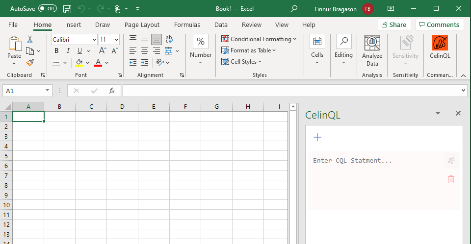

# Overview

An Excel Add-in to query JDE tables and business views.

## Usage Example

Select the CelinQL Add-in on the home menu to open the CelinQL editor.

The Add-in consists of an editor to enter the CelinQL statements, and Submit, Delete and Add Editor buttons.
